# GridWorld RL Comparison
Author: Bagautdin Nukhkadiev

## Installation
```bash
pip install -r requirements.txt
```

Reproduce any experiment by running command like 
```bash
python -m experiments.<experiment name>
```
For example
```bash
python -m experiments.run_q_learning
```
## GridWorld
The manually implemented simple gridworld environment used in the experiments looks like this:

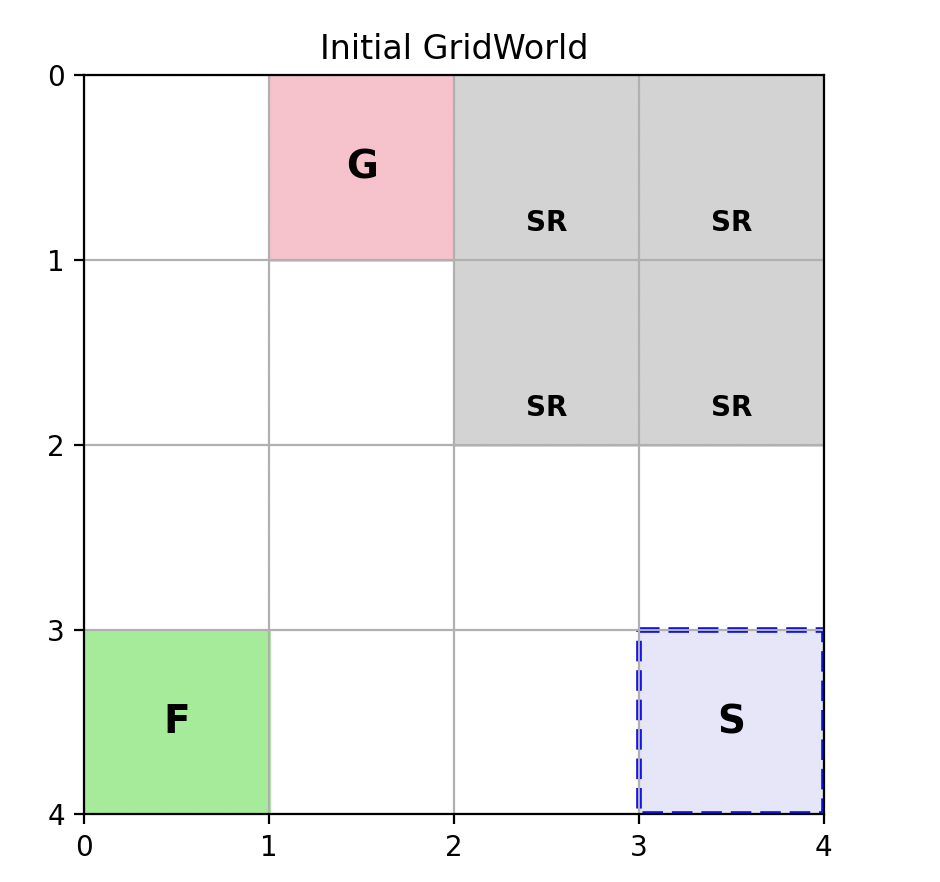

## Value Iteration

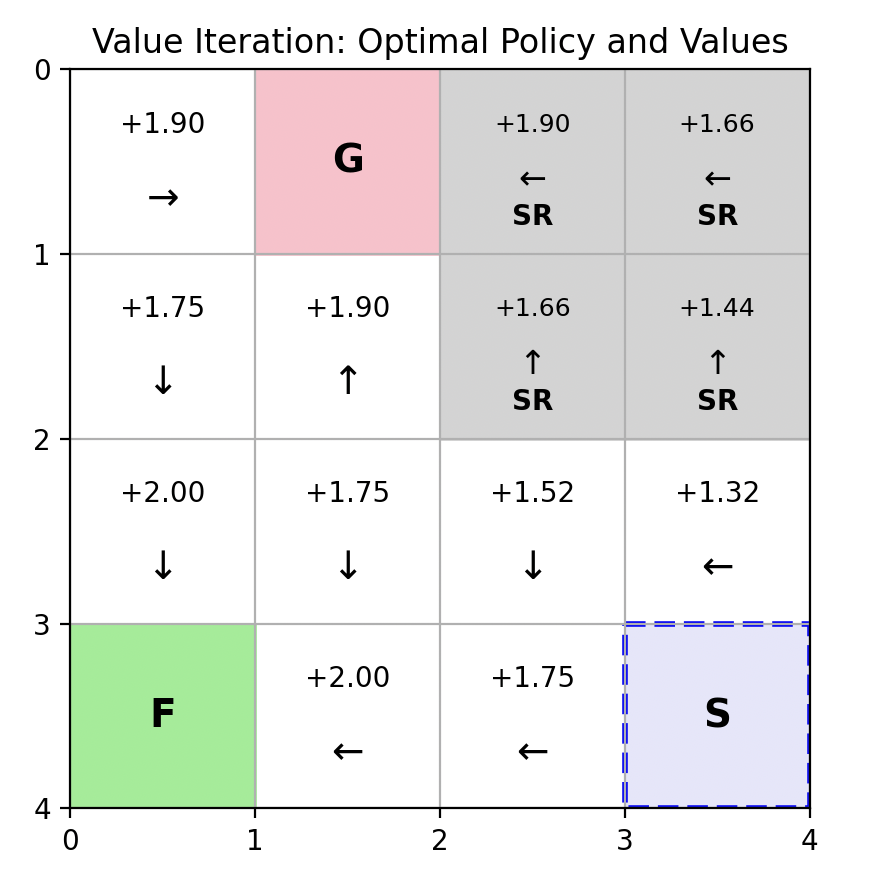

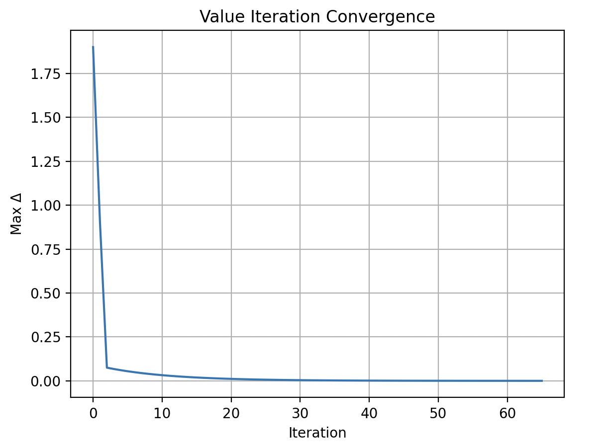


## Policy Iteration
We have implemented greedy and epsilon-soft policy iteration algorithms. 


## Policy Evaluation Comparisons
We are comparing the

Monte Carlo evaluation takes very long time to compute compared to other methods. 


## Q-learning

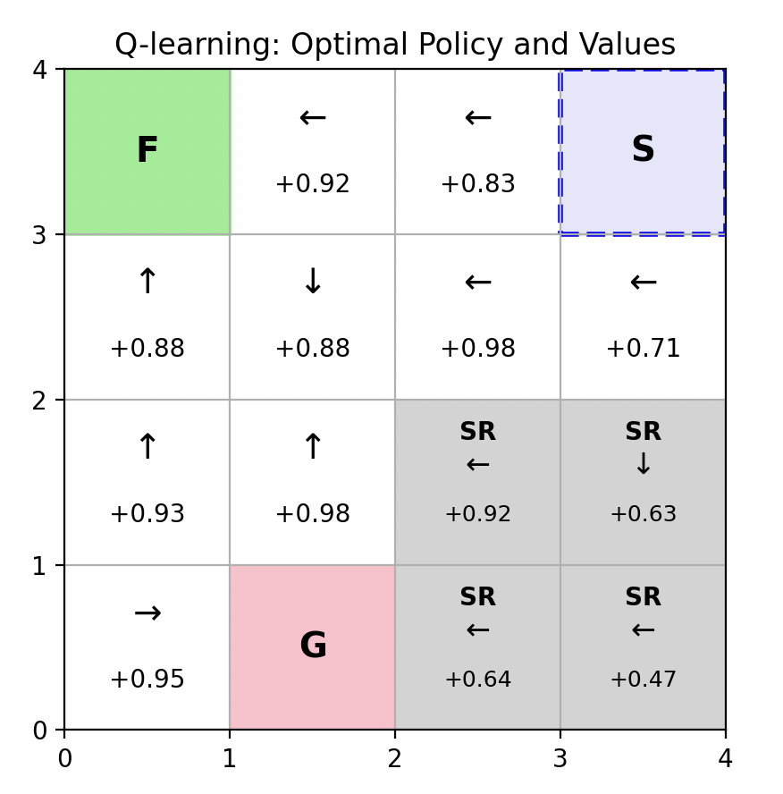

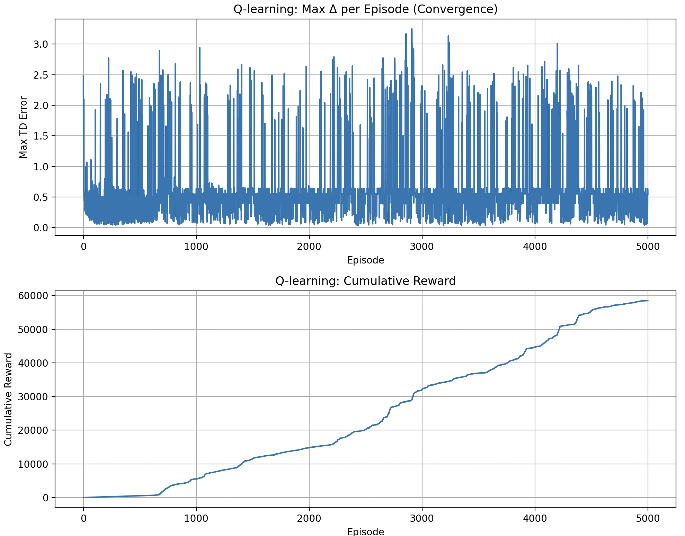


## Q-Algos comparison

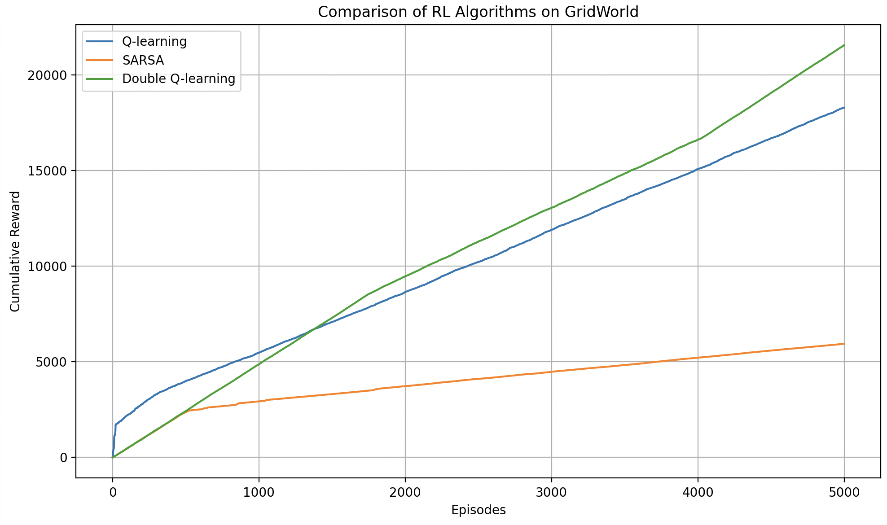


## a) 
Empirically verify the convergence rates of iterative methods that rely on known transition probabilities, comparing them to the convergence speed of sample-based algorithms.

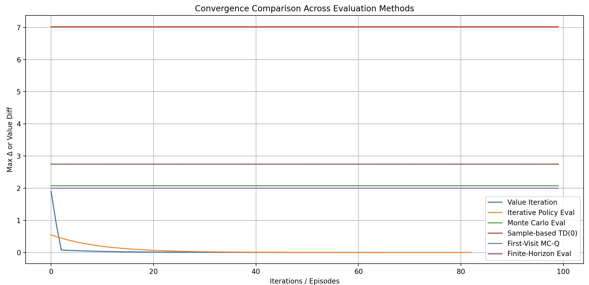

## b)
| Concept              | Finite-Time MDP                                       | Discounted MDP                                               |
|----------------------|--------------------------------------------------------|---------------------------------------------------------------|
| Time Horizon         | Fixed, e.g. T = 1000 steps                               | Infinite (potentially infinite steps into the future)         |
| Value Function       | V_t(s): Value depends on time t and state s           | V(s) = E[sum of gamma^t * r_t]: infinite discounted sum       |
| Discounting          | No discounting; horizon defines importance             | Uses gamma in [0, 1) to weigh future rewards less             |
| Optimal Policy       | Non-stationary (depends on remaining time)            | Stationary (same at every timestep for given state)           |
| Typical Use Case     | Games, deadline-based planning, short-term decisions  | Navigation, maintenance, inventory — long-term decisions      |

## c) 
Define and demonstrate the following effects by constructing ”extreme“ MDPs that maxi-
mize their visibility, supporting your explanations with appropriate graphs:
• Backpropagation
• Robust Reinforcement Learning
• Overestimation Bias


### Backpropagation
Here the extreme MDP would be a long hallway GridWorld (e.g. 1×8). This allows us to put the goal reward at the end (rightmost state) and observe how values slowly backpropagate from goal to start.

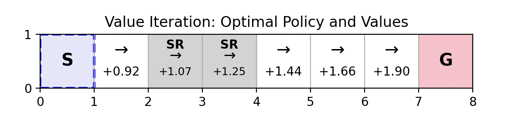


### Robust Reinforcement Learning
The idea that the learned policy should still perform well even if environment dynamics change slightly. For that, we add some wind and slippery floor. 

The experiment setting for this would be to train and evaluate policies under:
- Environment A (no wind)
- Environment B (with wind)
- Plot average episode reward or goal reach rate.

### Overestimation bias
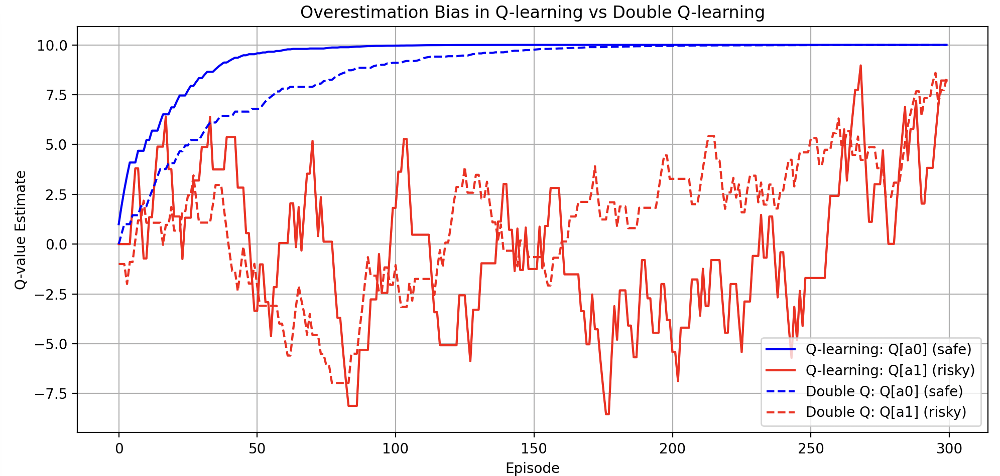


## d) 

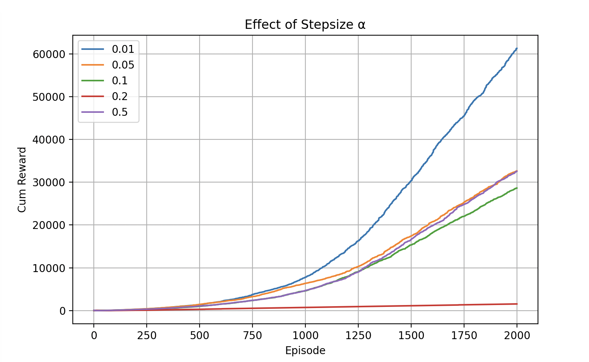

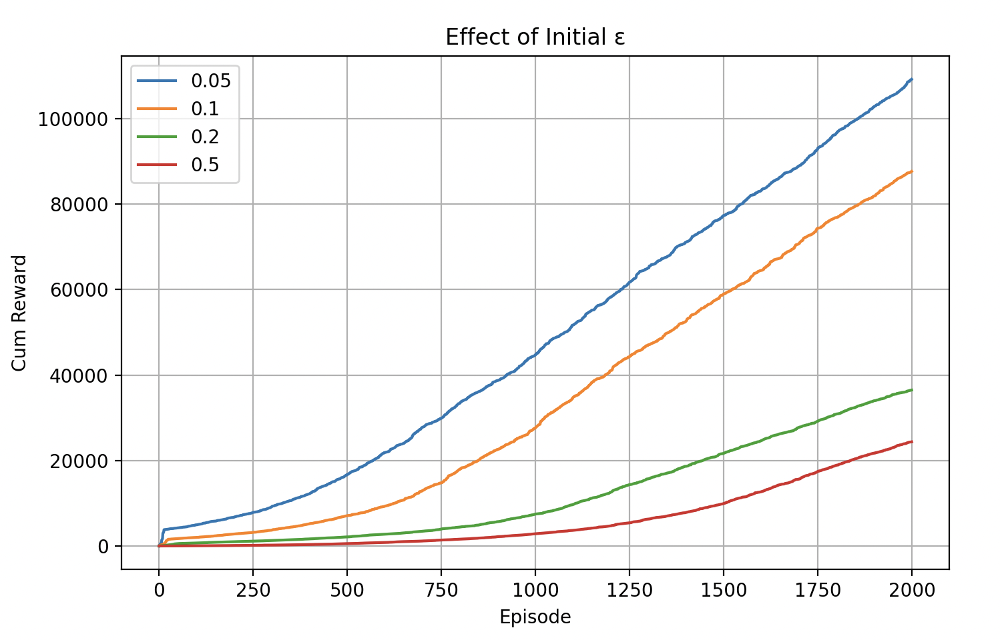

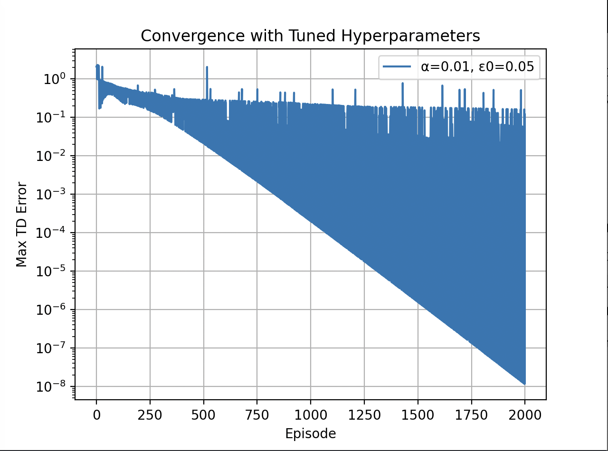
