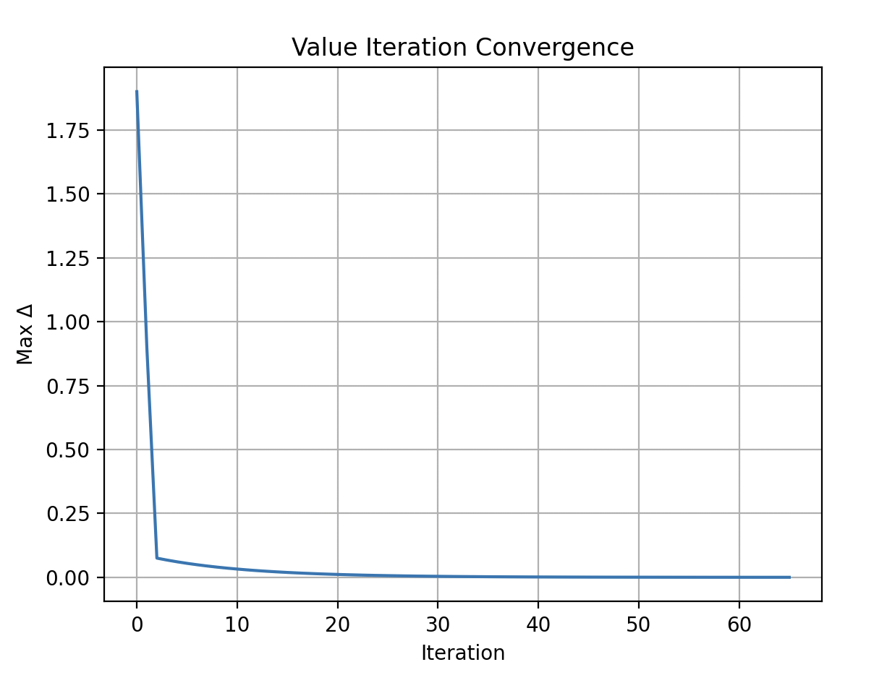

# GridWorld RL Comparison
Author: Bagautdin Nukhkadiev

## Installation
```bash
pip install -r requirements.txt
```

Reproduce any experiment by running command like 
```bash
python -m experiments.<experiment name>
```
For example
```bash
python -m experiments.run_q_learning
```
## GridWorld
The manually implemented simple gridworld environment used in the experiments looks like this:


## a) Convergence of Iterative vs Sample-Based Methods
Empirically verify the convergence rates of iterative methods that rely on known transition probabilities, comparing them to the convergence speed of sample-based algorithms.
We conducted an empirical comparison of convergence rates across different value evaluation methods:

<p float="left">  </p>

- Value Iteration shows **much faster convergence** than IPE. This is expected because VI applies the **Bellman optimality operator**, greedily improving values, while IPE only evaluates a fixed policy using the **Bellman expectation operator**.
- On a logarithmic scale, VI reduces the max delta by several orders of magnitude within just a few iterations, whereas IPE converges gradually.


<p float="left">  </p>

Key Observations:

We observed that **Value Iteration** and **Iterative Policy Evaluation** — both relying on known transition probabilities — converge significantly faster than sample-based alternatives. In particular, **Value Iteration** reaches near-zero Bellman error within as few as 5–10 iterations, demonstrating its efficiency and precision in computing optimal value functions. **Iterative Policy Evaluation**, while slightly slower, still exhibits steady and reliable convergence.

In contrast, **sample-based methods** such as **Monte Carlo Evaluation**, **TD(0) Evaluation**, **First-Visit Monte Carlo Q Evaluation**, and **Finite-Horizon Evaluation** showed substantially slower convergence. These methods tend to plateau at higher Bellman error values and fail to approach the accuracy of model-based methods, even after thousands of episodes. **Monte Carlo** and **TD(0)** evaluation displayed high variance — an inherent characteristic of these estimators — while the finite-horizon and first-visit approaches similarly struggled to match the convergence behavior of their model-based counterparts.

These results empirically confirm that when the model is known, leveraging the transition dynamics offers a clear advantage in convergence speed and precision over sampling-based learning techniques.

## b)

| Concept              | Finite-Time MDP                                       | Discounted MDP                                               |
|----------------------|--------------------------------------------------------|---------------------------------------------------------------|
| Time Horizon         | Fixed, e.g. T = 1000 steps                               | Infinite (potentially infinite steps into the future)         |
| Value Function       | V_t(s): Value depends on time t and state s           | V(s) = E[sum of gamma^t * r_t]: infinite discounted sum       |
| Discounting          | No discounting; horizon defines importance             | Uses gamma in [0, 1) to weigh future rewards less             |
| Optimal Policy       | Non-stationary (depends on remaining time)            | Stationary (same at every timestep for given state)           |
| Typical Use Case     | Games, deadline-based planning, short-term decisions  | Navigation, maintenance, inventory — long-term decisions      |


**Reward Design Considerations:**

The type of MDP determines how rewards should be structured:

- **In finite-time MDPs**, rewards closer to the horizon \( T \) are more impactful. Therefore, if we want the agent to reach a **specific target state at the end**, we can place a **large terminal reward** at the goal and the agent will learn to aim for it precisely.

- **In discounted MDPs**, earlier rewards matter more due to the compounding effect of the discount factor. To teach an agent to reach a goal that is far away, we must either:
  - Increase the reward magnitude at the goal significantly to compensate for discounting.
  - Design **dense intermediate rewards** to guide the agent toward the goal incrementally.


## c) 
Define and demonstrate the following effects by constructing ”extreme“ MDPs that maximize their visibility, supporting your explanations with appropriate graphs:
• Backpropagation
• Robust Reinforcement Learning
• Overestimation Bias


### Backpropagation
Here the extreme MDP would be a long hallway GridWorld (e.g. 1×8). This allows us to put the goal reward at the end (rightmost state) and observe how values slowly backpropagate from goal to start.


### Robust Reinforcement Learning
Robust Reinforcement Learning aims to train agents that perform reliably even under perturbations or slight mismatches between training and deployment environments.

In our initial experiment, we trained a Q-learning agent in a clean environment (Env A) and evaluated it in a perturbed version (Env B) with wind and slippery floors. While performance in Env A was perfect (reward ≈ +7.3), in Env B, rewards were volatile and significantly lower, revealing the lack of robustness in the trained policy.


This result illustrates a key challenge: training in clean environments doesn't prepare agents for real-world uncertainty.

To make the policy robust to dynamics changes, we can:
- Train under stochasticity: Add wind and slip during training, so the agent learns to expect perturbations.
- Use safety penalties: Add large negative rewards for dangerous states, discouraging risky paths.
- Risk-sensitive RL: Train with objective functions that penalize high-variance or tail-risk outcomes.


### Overestimation bias
To illustrate overestimation bias, we designed an environment with two actions: one safe and one risky. The risky action has high reward variance, occasionally yielding large positive rewards, but often low or negative ones.

We trained both Q-learning and Double Q-learning and plotted the Q-value estimates over time:


From the graph, we observe:

Q-learning (solid lines) significantly overestimates the Q-value of the risky action (red), with wild fluctuations and upward drift.

In contrast, Double Q-learning (dashed lines) produces much more conservative and stable estimates for the same action.

For the safe action (blue), both methods converge more reliably, but Q-learning still slightly overestimates compared to Double Q.

This confirms the known bias in Q-learning: because it uses max_a Q(s', a) to bootstrap updates, it favors high-variance actions, even if their expected return is worse. Double Q-learning avoids this by decoupling action selection and evaluation, reducing the impact of spurious high estimates.


## d) Influence of Stepsize (α) and Exploration (ε) Parameters on Q-Learning

This section investigates how the **learning rate (α)** and **exploration parameter (ε)** affect the learning stability and performance of Q-learning. We evaluate different configurations by comparing:

- Average episodic rewards (revealing short-term behavior)
- Convergence of TD errors (revealing learning stability)

---

### Effect of Learning Rate α

<p float="left">
  
</p>

We tested various values of the learning rate α. A smaller α (e.g., **0.01**) results in higher and more stable performance, while larger values cause the agent to overshoot good Q-values, leading to instability and lower rewards.

<p float="left">
  
</p>

**Observation**:  
- **Low α** → smoother and higher reward curves  
- **High α** → unstable and less reliable learning

**Conclusion**:  
A small α promotes stable convergence by limiting drastic Q-value updates, which is especially useful in stochastic environments.

---

### Effect of Initial Exploration Rate ε₀

<p float="left">
  
</p>

We experimented with different initial ε values, controlling how much the agent explores at the start. An exponentially decaying schedule is used:
$\varepsilon_t = \max(0.01, \varepsilon_0 \cdot e^{-kt})$


<p float="left">
  
</p>

**Observation**:  
- **Lower ε₀ = 0.05** → quicker and better convergence  
- **Higher ε₀** → more exploration early on, but slower exploitation

**Conclusion**:  
Start with moderate exploration (ε₀ ≈ 0.3) and decay it over time to **balance exploration and exploitation**. Too much early exploration can delay learning progress.

---

### Convergence Behavior with Tuned Hyperparameters

With α = 0.01 and ε₀ = 0.05, Q-learning converges smoothly:

<p float="left">
  
</p>

**Observation**:
- The TD error decreases **exponentially**
- Occasional small spikes occur due to stochastic transitions
- Final errors reach below 10⁻⁶, confirming convergence

---


## e) Comparison of Actor-Critic and Q-Learning
Compare the general actor-critic method to direct stochastic control algorithms that utilize
the Bellman Optimality Operator.


We empirically compared the performance of the general Actor-Critic method against Q-learning, a direct control algorithm utilizing the Bellman Optimality Operator.

<p float="left">   </p>
As shown in the cumulative reward plot (left), Q-learning accumulates higher rewards over training episodes compared to Actor-Critic. However, the TD-error convergence plot (right) highlights that the Actor-Critic method exhibits larger TD-errors during training, suggesting less stable value estimation. This is expected because Actor-Critic updates are inherently noisier due to stochastic policy gradients and continuous interaction.

Interestingly, despite achieving lower cumulative rewards, Actor-Critic produced a qualitatively better final policy. In our environment containing a fake goal, Q-learning learned a policy that often gets baited into the suboptimal (false) goal. In contrast, Actor-Critic correctly ignored the fake goal and constructed a policy that reliably leads to the true goal.

This behavior highlights a crucial difference: Q-learning overestimates action values, especially under stochastic rewards (overestimation bias), while Actor-Critic’s direct policy learning helps avoid such traps even at the cost of sample inefficiency.

Final learned policies are visualized below:

<p float="left">   </p>
On the left, Q-learning often navigates toward the false goal; on the right, Actor-Critic steadily reaches the true goal.


# Appendix

## Value Iteration





## Policy Iteration
We have implemented greedy and epsilon-soft policy iteration algorithms. 


## Policy Evaluation Comparisons
We are comparing the

Monte Carlo evaluation takes very long time to compute compared to other methods. 


## Q-learning


## Q-Algos comparison


